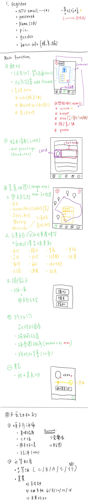

# Ceres

# Register
- NTU email
- password
- Name (ID)
- pic.
- gender
- basic info (院/系/級)
- delicacy tendency (喜歡吃啥)

# Main function
1. Matching
	- 1天先10個, 登入後每小時+1
	- 雙方同意 => add friends
	- 呈現data
		1. info (院/系/級)
		2. 配對成功次數(率)
		3. 常吃料理

2. Friend list
	- default greeting
	- tap頭貼 => personal information
	- other => chat

3. Delicacy map (Google map, 台大周圍)
	1. Restaurant
		- 店名
		- Google評價/FB評價
		- 地址
		- 營業時間
		- 配對次數
	
	2. 餐廳分類(可重複標籤) => 自由選擇呈現類別
		- 中式
		- 台式
		- 南洋
		- 火鍋
		- 韓式
		- 日式
		- 西式
		- 速食
		- 素食
		- 健身餐
		- 咖啡廳
		- 甜點/冰
		- 手搖
		- 吃到飽

	3. 擲骰子
		- 推一家(用餐廳介紹卡)

4. 折扣
	- 台大特約商店
		- 按目前距離 (distance oriented)
		- 按商圈排序(area in module 1)
		- 按折扣多寡(比率) (discount oriented)

5. Others
	- 我的美食ID

# Personal information
1. cuisine
2. budget
3. area
4. 院/系/級
5. gender

# 用戶互動機制
1. 餐廳評論
	- 美味程度
	- 用餐環境
	- CP值
	- 短評(opt.)
	- reward
		1. 榮譽值
		2. 貼圖

2. 升等制度
	- 等級(C/B/A/S/SS)
	- 差異
		1. 卡片帥
		2. 抽卡數 -> 6/8/10/12/15
		3. 未來折扣

------------------------------------

